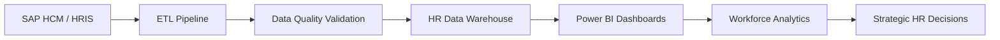

# 👋 Hi, I'm Brisseth Parina

#### Building data pipelines that transform workforce data into strategic decisions.

## About Me

I'm an Industrial & Commercial Engineer passionate about Data Engineering and People Analytics.
What draws me to People Analytics is the opportunity to use data not only to improve business outcomes, but also to better understand how organizations can support people's growth, development, and opportunities.
Currently pursuing a Data Engineering Specialization at Universidad Ricardo Palma in Peru (online), I am focused on building reliable data pipelines and analytical solutions that transform workforce data into meaningful insights and strategic decisions.

## Current focus:

👥 People Analytics - ⚙️ Data Engineering - 📊 Workforce Intelligence - ☁️ Cloud Data Solutions - 🤖 Process Automation

---

### 🛠️ Tech Stack

    

    

---

## 👥 People Analytics Data Pipeline

---

## 📊 Core Competencies

| Data Engineering | People Analytics | Business Intelligence |
|------------------|------------------|------------------------|
| ETL / ELT | Headcount Analytics | Power BI |
| Data Quality | Turnover Analysis | KPI Design |
| Data Modeling | Absenteeism Analytics | Dashboard Development |
| SQL | Workforce Metrics | Executive Reporting |
| Python | Compensation Analytics | Data Storytelling |

---

## 🌍 International Experience

🇵🇪 Peru

🇦🇹 Exchange Semester at MCI – Austria

🎓 Ernst Mach Grant Recipient

---

## 📈 GitHub Analytics

---

## 🌱 Currently Learning

- Data Warehousing
- Advanced SQL
- Data Modeling
- AWS Data Services
- HR Analytics Automation
- Machine Learning for Workforce Analytics

---

## 📫 Connect With Me

💼 LinkedIn: linkedin.com/in/brisseth

📧 Email: brisseth.parina@gmail.com

